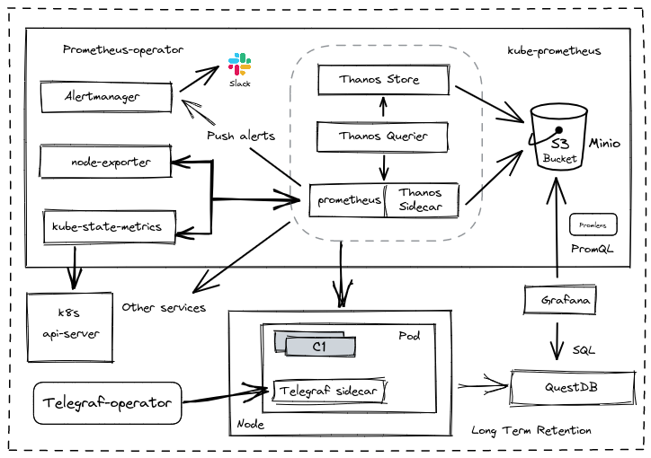

# Live-Infra

(TODO!!!)

Repository of application definitions, configurations and environments in a declarative and versioned control fashion that provides a cluster monitoring stack for arm64 platform. Live Infra uses [Flux V2](https://fluxcd.io/) to keep k3s clusters sync and updated. 

Infrastructure services and applications are installed and updated automatically when changes in the repository are detected. This mechanism is done with controllers in the clusters which detects change in the source code.

The components that are included are explained below.

## Prerequisites

You will need to meet the following in order to spin up Live Infra

- Kubernetes cluster version 1.16 or newer.
- kubectl version 1.8 or newer.
- Flux V2 version 0.17.2 or newer.
- A bunch of raspberry pi's.

### Prerequisites by folder 

+ The production code has a few customizations in order to bootstrap the cluster in the arm64 processor architecture so it'll probably fail
in other architectures, I did not tested yet though. 

+ Note that in order to spin up `production` you will need at least 4 nodes (TODO)

+ All of the code inside `staging` and `testing` can be run in an `x86` processors and it doesn't use flux in order to sincronize the changes.Instead of flux there is a `Makefile` to apply all the changes. (TODO) 


## Repository structure
```
Tools
  ├── production
  │   └── ...     => Code running in the cluster
  ├── staging
  │   └── ...     => Same code as production but tested locally before applying changes
  └── testing
      └── ...     => Let's have some fun!
```

## Components

<details><summary> <b>Metrics</b> </summary>
<p>

 * [Kube-Prometheus](https://github.com/prometheus-operator/kube-prometheus#kube-prometheus) the Kubernetes monitoring stack
    * [Prometheus](https://github.com/prometheus/prometheus) to collect metrics
    * [AlertManager](https://github.com/prometheus/alertmanager#alertmanager-) to fire the alerts
    * [Grafana](https://github.com/grafana/grafana) to visualize what's going on
    * [Node-Exporter](https://github.com/prometheus/node_exporter) to export metrics from the nodes
    * [Kube-State-Metrics](https://github.com/kubernetes/kube-state-metrics) to get metrics from kubernetes api-server
    * [Prometheus-Operator](https://github.com/prometheus-operator/prometheus-operator#prometheus-operator) to manage the life-cycle of Prometheus and AlertManager custom resource definitions (CRDs)
 * [Thanos](https://github.com/thanos-io/thanos) set of components that can be composed into a highly available metric system with long term storage which is added seamlessly on top of existing Prometheus deployments. 
 * [Promlens](https://promlens.com/) tool to build and analyse promql queries with ease.
 * [QuestdB](https://questdb.com/) High-performance, open-source SQL database for applications such as IoT, DevOps and observability.
 * [Telegraf-operator](https://questdb.com/) Monitor applications easily with telegraf running as a sidecar. 


</p>
</details>

<details><summary> <b>Logging</b> </summary>
<p>


</p>
</details>
<details><summary> <b>Tracing</b> </summary>
<p>

</p>
</details>

## Bootstrap Tools

(TODO!!!)

Fork this repository on your personal Github account and export your Github access token, username and repo name:

```bash
export GITHUB_TOKEN=<your-token>
export GITHUB_USER=<your-username>
export GITHUB_REPO=<repository-name>
```

Verify that your staging cluster satisfies the prerequisites with:

```bash
flux check --pre
```

If everything worked fine bootstrap Tools:

```bash
flux bootstrap github \
    --owner=${GITHUB_USER} \
    --repository=${GITHUB_REPO} \
    --branch=master   
    --path=./Tools 
    --personal
```

The bootstrap command commits the manifests for the Flux components in `Tools/` dir and creates a deploy key with read-only access on GitHub, so it can pull changes inside the cluster. 

Flux components can be customized before or after running bootstrap in order to do edit`flux-system/gotk-patches.yaml` an example can be found in this repo under `Tools/flux-system`. For more information about the bootstrap command [see](https://fluxcd.io/docs/cmd/flux_bootstrap_github/#synopsis). 


## Secrets

TODO

## Testing

Any change to the Kubernetes manifests or to the repository structure should be validated in CI before a pull requests is merged into themaster branch and synced on the cluster.

This repository contains the following Github CI workflows:

+ The [test](./.github/workflows/test.yaml) workflow validates the Kubernetes manifests and Kustomize overlays with kubeval


## Roadmap


- [ ] Refactor some components
- [ ] Customize kube-prometheus 
- [ ] Add tracing tools support
- [ ] Add CI job to encypt sensitive data in the manifest files (Not likely) 
- [ ] The [e2e](./.github/workflows/e2e.yaml) workflow starts a Kubernetes cluster in CI and tests the staging setup by running Flux in k3d.

## Acknowledgements

Not all of the code here is my original work, but has been collated from and inspired by some fantastic contributors. Thank you all!

